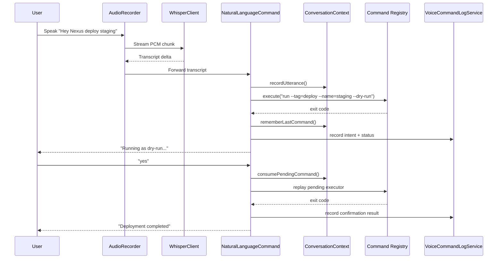

# Voice Intent Flow

The flow highlights where repeated commands and confirmations hook in:

- `ConversationContext` stores both pending confirmations and the most recent successful executor, enabling follow-ups such as “repeat that”.
- Each analytics event is persisted with an intent label, making confirmation counts and wake-word misses visible in the CLI and dashboard.
- Error hints are produced before the database write, so remediation advice appears immediately in the live session.
